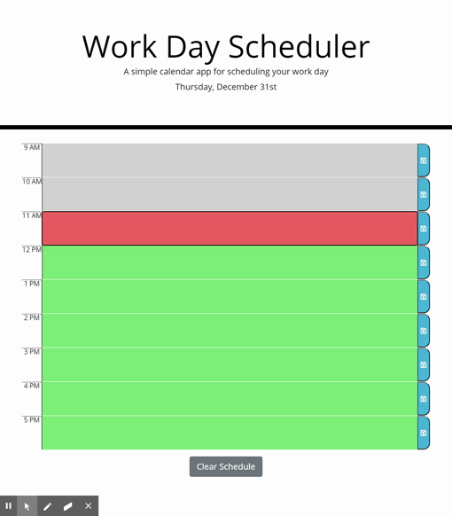

# Daily Planner

This daily planner project was an exercise in using learning to use JQuery. The planner displays the current date and a list of time blocks that can have text assigned to them. Each time block is color-coded to indicate whether it is in the past, present, or future. By clicking on a time block the user can type in text which is then saved to local storage using the save button located on the right hand side of each time block. This allows the contents of each text box to be saved in the event the page is refreshed or the browser is closed. Finally a button located at the bottom of the screen allows the user to clear the contents of all the text boxes and reset local storage. See the Goals and Methods section below for implementation details.



## Table of Contents

| |||
| :------------------------------ | :-------------------------| :-----------------------------------|
| [Project Introduction](#daily-planner) | [Table of Contents](#table-of-contents) | [Goals and Methods](#goals-and-methods) | 
| [Technologies](#technologies)   | [Deployed Link](#deployed-link) | [Authors](#authors) |
| [Acknowledgments](#acknowledgments) | [License](#license) |
---

## Goals and Methods

The functionality described above was broken down into a small collection of functions. By carefully ordering the implementation of these functions a project roadmap was attained. The first milestone was to create the HTML elements along with some identifying classes. Given that the planner was designed for use in a 9-5 work setting there was no need to create elements dynamically. The primary building block of this project was a time-block div that contained a label, textbox, and a save button. An example is shown is Snippet 1.

Snippet 1:
```HTML
<div class="row time-block" data-time="9">        
    <p class="hour"> 9 AM </p>
    <textarea type="text" class="description "></textarea>
    <button class="saveBtn"><i class="far fa-save"></i></button>
</div>
```
This modular design was adopted to speed development along. Each time-block had a data attribute that served as a means of identification and performing logical comparisons. 

Once the HTML elements were in place developing the save functionality became possible. The save function is attached to an event listener that targets each of the save buttons. When designing the implementation of the save function two distinct paths were considered:

* Save the text in the box immediately adjacent to the button that was just clicked; or
* Save the text in all boxes.

The later path was followed as it allows the user to enter text into several boxes and press a save button only once. Each time-block contains a save button as a convenience to the user. This approach also simplified the save algorithm. If the first path, described above, was followed it would have become necessary to splice values into an array since the order the user may add items to the time-blocks is not predictable. In addition the small number of time-blocks to manage meant that computation time was not considered as a factor. However, should the list of items grow large the more targeted approached to saving user input would be adopted. 

The JQuery method .each() was utilized to iterate over time-blocks and store the text contents of the input field into a temporary array. Text storage ocurred whether the time-block text field had contents or was empty. Writing empty strings into the temporary array served as a place holder which produced a list that matched the HTML structure (Snippet 2). After iterating over the entire time-block the contents of the temporary array was stringified and put into local storage:

Snippet 2:
```javascript
var tempScheduleArr = [];
$(".container .row").each(function () {			
    var thisRow = $(this);
    var rowTaskEl = thisRow.find("textarea:nth-child(2)");
    var rowTaskText = rowTaskEl.val();
    tempScheduleArr.push(rowTaskText);
});
localStorage.setItem("schedule", JSON.stringify(tempScheduleArr));
```
Arranging the local storage array such that each element was in the same position as its source time-block made loading the task list to the page a trivial process which strongly resembles the saving process in reverse. 

The last significant application process is dynamic styling applied dependant on the time of day. Each time-block was colored grey, red, and green to indicate that time-block was in the past, present, or future respectively. This was made possible by using moment.js. The current time was captured, formatted, and parsed so it could be compared to a given time-block's assigned value (Snippet 3). The appropriate CSS class would be added to the time-block depending on the result of this comparison. This functionality was wrapped in a function so that it can be called frequently. 

Snippet 3:
```javascript
$(".container .row").each(function () {
    var rowTime = $(this).data("time");
    var rowTaskEl = $(this).find("textarea:nth-child(2)");
    if (rowTime < currentHour) {
        rowTaskEl.addClass("past");
    ...
```
## Technologies 

* [HTML](https://developer.mozilla.org/en-US/docs/Web/HTML)
* [CSS](https://developer.mozilla.org/en-US/docs/Web/CSS)
* [Javascript](https://developer.mozilla.org/en-US/docs/Web/JavaScript)
* [Bootstrap](https://getbootstrap.com/)
* [Jquery](https://jquery.com/)

## Deployed Link

* [See Live Site](https://coleman-buffa.github.io/daily-planner/)

## Authors

Coleman Buffa

- [Link to Git Hub](https://github.com/coleman-buffa/)
- [Link to LinkedIn](https://www.linkedin.com/in/coleman-buffa-0a12a5201/)

## Acknowledgments

Many thanks to UCB Bootcamp Instructional and Support Staff

## License

* Bootstrap and JQuery are both released under the MIT license 

### [Back to Table of Contents](#table-of-contents)